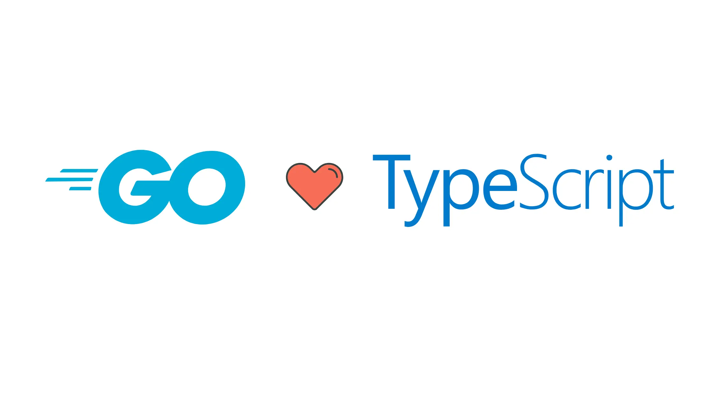

# Is TypeScript-Go Production Ready? 



`The Future of Fast, Native TypeScript Compilation`


The TypeScript community is abuzz with one of its boldest experiments yet: **rewriting the TypeScript compiler in Go**. If you’ve ever groaned at slow build times or memory-hungry processes, this project—housed at [github.com/microsoft/typescript-go](https://github.com/microsoft/typescript-go)—is set to change your workflow forever.

## Why Rewrite TypeScript in Go?

TypeScript’s original compiler, written in JavaScript, has served millions of developers well. But as codebases balloon in size, performance bottlenecks have become impossible to ignore. The Go port promises:

- **Up to 10x faster compilation**
- **Significantly reduced memory usage**
- **A path to native binaries for every platform**

This isn’t just a technical flex. Faster builds mean tighter feedback loops and happier developers.

## Is TypeScript Go Ready for Production?

**Not yet—but it’s getting there.**

The Go-based compiler is currently in an **experimental preview** phase. Here’s what you need to know:

- **What works:** Command-line type checking is available, and early benchmarks are impressive.
- **What’s missing:** Features like full JSX/JSDoc support, incremental builds, advanced project modes, and seamless editor integration are still in development.
- **Roadmap:** A feature-complete release is targeted for late 2025, with dual support for both compilers planned during the transition.

| Milestone                         | Target Date      | Status          |
|------------------------------------|------------------|-----------------|
| Preview with basic type checking   | Mid-2025         | In progress     |
| Feature-complete release           | Late 2025        | Not yet reached |
| Dual compiler support (6.x & 7.0)  | 2025–2026        | Planned         |

## What’s Inside the Repo?

The [typescript-go](https://github.com/microsoft/typescript-go) repository is a treasure trove for language nerds and early adopters:

- The Go-based TypeScript compiler and supporting tools
- CI workflows for building and testing across platforms
- Scripts for integrating with Node.js and Rust (for advanced tasks)
- Automation for diagnostics, baselines, and regression testing
- Submodules for syncing with the upstream TypeScript source

## How to Try TypeScript Go Locally

Curious? Here’s how to get your hands dirty:

1. **Clone the Repository**
   ```bash
   git clone https://github.com/microsoft/typescript-go.git
   cd typescript-go
   ```

2. **Install Prerequisites**
   - Go (latest stable)
   - Node.js (LTS)
   - Rust (optional, for some tasks)

3. **Install Node.js Dependencies**
   ```bash
   npm ci
   ```

4. **Build the Go Compiler**
   ```bash
   npx hereby build
   ```

5. **Run the Compiler**
   ```bash
   ./built/local/tsgo -p ./path/to/your/project
   ```

6. **Run Tests and Benchmarks**
   ```bash
   npx hereby test
   npx hereby test:benchmarks
   ```

Try it on a small project, see the speed, and report your findings!

## Should You Switch Today?

- **For production:** Stick with the classic TypeScript compiler (6.x) for now. The Go version is not yet feature-complete.
- **For experimentation:** Give the Go compiler a spin on side projects or in CI. Your feedback is invaluable to the team.

## Why This Matters

- **Performance:** Faster builds mean more productive teams.
- **Native Tooling:** After the transition, you’ll be able to use TypeScript without Node.js.
- **Community Power:** Early adopters help shape the future of TypeScript.

## Final Thoughts

The Go-powered TypeScript compiler is one of the most exciting developments in the language’s history. While it’s not ready for production just yet, it’s racing toward a future where TypeScript is faster, leaner, and more native than ever. Want to be part of the journey? Dive into the [typescript-go repo](https://github.com/microsoft/typescript-go), experiment, and help shape the next chapter of TypeScript.

*Have you tried TypeScript Go? Share your experience and let’s build the future together!*
